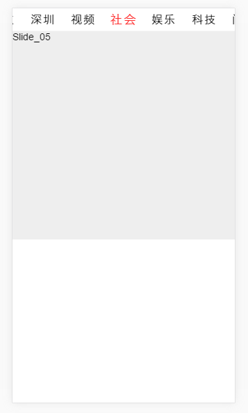
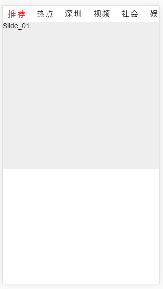

# slide_tab_center
移动端轮播  导航+内容页的轮播，选中的导航居中（最边的除外） 
 
> 1、内容部分滑动： 
导航会随着内容部分的滑动，高亮对应的导航内容，并把高亮的导航居中（导航1/2部分 导航倒数1/2部分不动，否则导航就有空缺部分，比较丑） 
 
 

> 2、导航部分滑动： 
导航部分可以滑动，也可以点击，点击的时候除了高亮和显示对应的内容，高亮的部分也会居中显示 

> 效果图 
 

